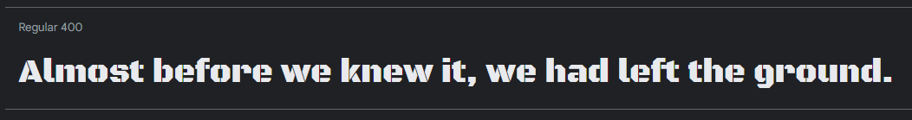
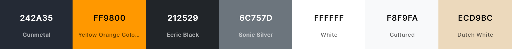
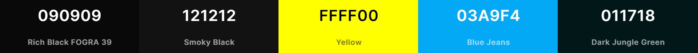

<h1 align="center"> 
	<a href="https://flare-medfm.github.io/">flare-medfm.github.io</a> - v2.0
	<p align="center">
		
		
		
		
		
		
		
		
		 
	</p>
</h1>

<br/>

<div align="center">
	<a href="https://github.com/flare-medfm/flare-medfm.github.io">
		
	</a>
	<h3 align="center">Jayant Goel (JayantGoel001)'s Personal Portfolio</h3>
	<p align="center">
		This is the source code for my Personal Portfolio.
		<br/>
		<a href="https://github.com/flare-medfm/flare-medfm.github.io"><strong>Explore the docs »</strong></a>
		<br/>
		<br/>
		<a href="https://flare-medfm.github.io/">View Demo</a>
		·
		<a href="https://github.com/flare-medfm/flare-medfm.github.io/issues/new?assignees=JayantGoel001&labels=bug&template=bug_report.yml&title=%5BBUG%5D%3A+">Report Bug</a>
		·
		<a href="https://github.com/flare-medfm/flare-medfm.github.io/issues/new?assignees=&labels=enhancement&template=feature_request.yml&title=%5BFEAT%5D%3A+">Request Feature</a>
	</p>
	<p>
		 • 
		 • 
		 •
		 •
		
	</p>
	<p>
		 •
		
	</p>
</div>

<br/>

<p align="center">
  <a href="https://flare-medfm.github.io/">
    
  </a>
</p>

## Table of Contents :scroll:

-   [Design](#design-art)
    -   [Fonts](#fonts)
    -   [Color Scheme](#color-scheme)
    -   [Icon](#icon)
-   [Built With](#built-with-package)
-   [How to Run Locally?](#how-to-run-locally-dart)
-   [Sections](#sections-bookmark)
-   [Folder Structure](#folder-structure-open_file_folder)
-   [Search engine optimization(SEO)](#search-engine-optimizationseo-spider)
-   [PageSpeed Insights](#pagespeed-insights)
-   [Creator / Maintainer](#creator--maintainer-man_technologist)
-   [Contributing](#-contributing)
-   [Contributors](#contributors-)
-   [License](#-license)

## Design :art:

### Fonts

[Black Ops One](https://fonts.google.com/specimen/Black+Ops+One) - Text Style



### Color Scheme

#### Main Screen

-   **Gunmetal** - Primary theme color
-   **Yellow Orange Color Wheel** - Secondary theme color
-   **Eerie Black** - Dark Text Color
-   **Sonic Silver** - Muted Text Color
-   **White** - Text Color
-   **Cultured** - Light Text Color & Light Background Color
-   **Dutch White** - Waifu Tips Background Color

<a href="https://coolors.co/242a35-ff9800-212529-6c757d-ffffff-f8f9fa-ecd9bc">
  
</a>

<br/>
<br/>

#### Splash Screen & 404 Page

-   **Rich Black FOGRA 39** - Background Color of Splash Screen
-   **Smoky Black** - Path of Splash Circle of Splash Screen
-   **Yellow** - Outer Splash Circle color
-   **Blue Jeans** - Inner Splash Circle color
-   **Dark Jungle Green** - 404 Text Color

<a href="https://coolors.co/090909-121212-ffff00-03a9f4-011718">
  
</a>

### Icon

This is the Favicon of me in [flare-medfm.github.io](https://flare-medfm.github.io)


Insert the following code in the `<head>` section of your pages to support favicons on all browsers and platforms.

```html
<meta name="theme-color" content="#242a35" />
<link rel="manifest" href="manifest.webmanifest" />
<link rel="icon" type="image/png" sizes="16x16" href="favicon-16x16.png" />
<link rel="icon" type="image/png" sizes="32x32" href="favicon-32x32.png" />
<link rel="apple-touch-icon" sizes="180x180" href="apple-touch-icon.png" />
<link rel="mask-icon" href="assets/images/safari-pinned-tab.svg" color="#242a35" />
<meta name="msapplication-TileColor" content="#242a35" />
<meta name="msapplication-TileImage" content="assets/images/mstile-70x70.png" />
<meta name="msapplication-TileImage" content="assets/images/mstile-144x144.png" />
<meta name="msapplication-TileImage" content="assets/images/mstile-150x150.png" />
<meta name="msapplication-TileImage" content="assets/images/mstile-310x150.png" />
<meta name="msapplication-TileImage" content="assets/images/mstile-310x310.png" />
```

Results :- [100%](https://realfavicongenerator.net/favicon_checker?protocol=https&site=flare-medfm.github.io)

These are the Font Awesome Icons used in [flare-medfm.github.io](https://flare-medfm.github.io)


## Built With :package:

-   💙 [HTML5](https://www.w3schools.com/html/)
-   💜 [CSS3](https://www.w3schools.com/css/)
-   💙 [JavaScript](https://www.w3schools.com/js/DEFAULT.asp)
-   💜 [TypeScript](https://www.typescriptlang.org/)
-   💙 [Angular](https://angular.io/)
-   💜 [NodeJS](https://nodejs.org/)
-   💙 [Bootstrap](https://getbootstrap.com/)
-   💜 [Google Font](https://fonts.google.com/) for the fonts
-   💙 [FontAwesome](https://fontawesome.com/) for the icons
-   💜 [GitHub Pages](https://pages.github.com/) for hosting
-   💙 [Apify](https://apify.com/) for generating screenshot of website
-   💜 [SmartMockups](https://smartmockups.com/) for adding mockups/desktop background to screenshot

## How to run locally? :dart:

Make sure you have [Node](https://nodejs.org/en/) and [git](https://git-scm.com/) installed.

```bash
node --version
git --version
```

-   Clone the repository :
    -   With HTTPS:
        ```bash
        git clone https://github.com/flare-medfm/flare-medfm.github.io.git
        ```
    -   With SSH:
        ```bash
        git@github.com:flare-medfm/flare-medfm.github.io.git
        ```
-   Navigate to working Directory and **main** branch

    ```bash
    cd flare-medfm.github.io
    git switch main
    ```

-   Install the dependencies:

    ```bash
    npm install -f
    ```

    -   Installs all the dependencies required by the project.

-   Fire up a development server:

    ```bash
    ng serve
    ```

    -   Runs the app in the `development` mode.
    -   Open [http://localhost:4200/](http://localhost:4200/) to view it in the Default Browser.
    -   The page will reload if you make edits.
    -   You will also see any lint errors in the console.

-   Deploy code to GitHub Pages (gh-pages):

    ```bash
    ng deploy --base-href="/portfolio/"
    ```

    -   Builds the application for production to the `build` folder & deploys application on `GitHub Pages`.
    -   It correctly bundles Angular in production mode and optimizes the build for the best performance.
    -   The build is minified and the filenames include the hashes.

-   Create a new branch:

    ```bash
    git checkout -b "<NAME-OF-THE-BRANCH>"
    ```

-   Add, Commit & Push the local changes to remote repository:

    ```bash
    git add .
    git commit -m "<COMMIT-MESSAGE>"
    git push origin <NAME-OF-THE-BRANCH>
    ```

## 🤝 Contributing

Contributions, Issues and Feature requests are Welcome!

Feel free to check the [Issues page](https://github.com/flare-medfm/flare-medfm.github.io/issues/).

## 📝 License

This project is [MIT](https://opensource.org/licenses/MIT) licensed.<br/>
Copyright &copy; 2025 Flare. All rights reserved.
